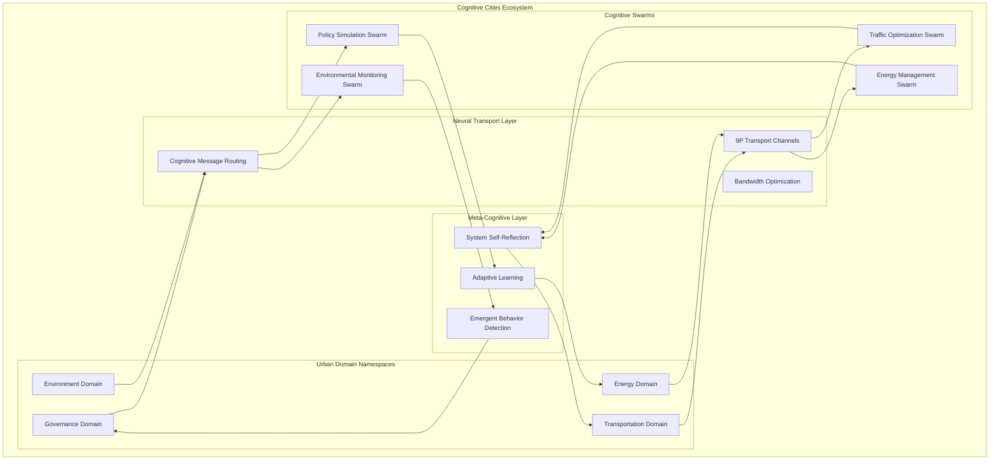
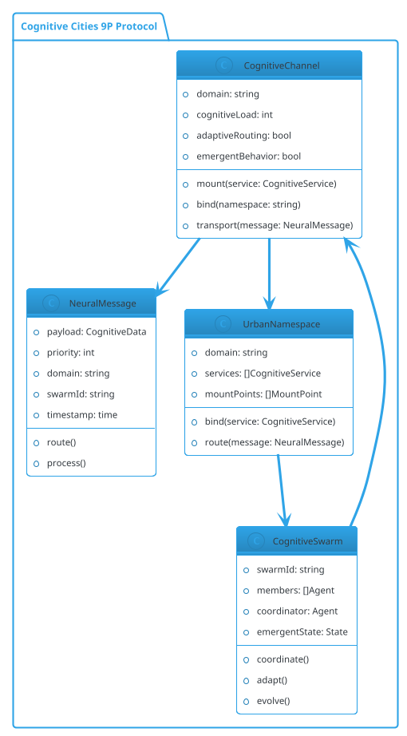
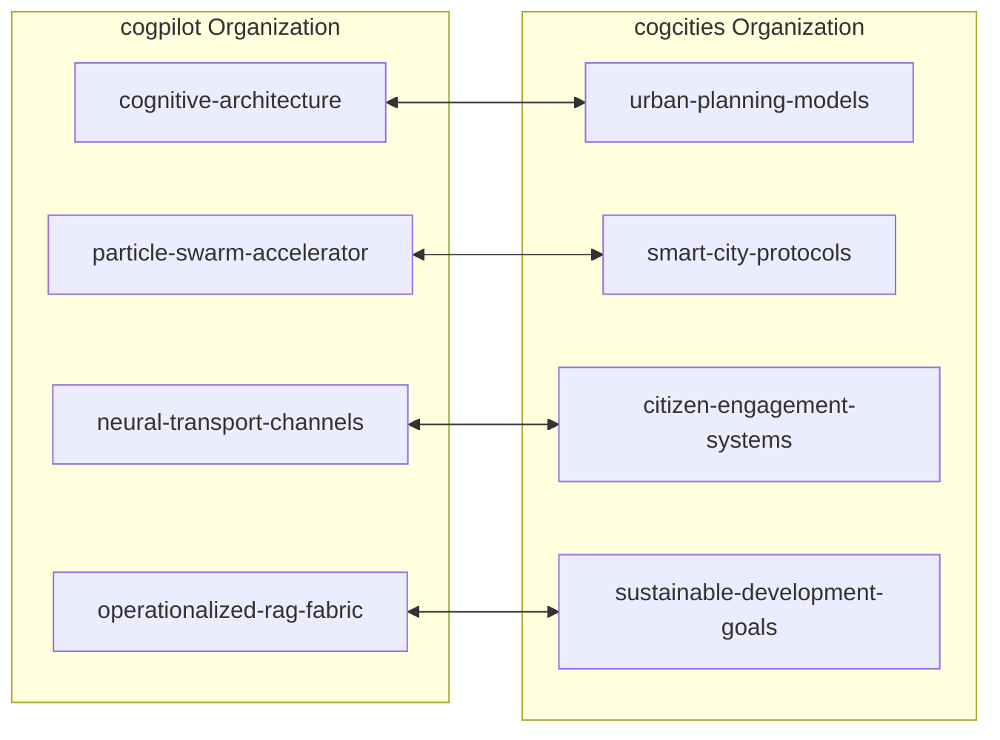

# Plan 9 Cognitive Cities Kernel

## 🏙️ Distributed Architecture for Cognitive Cities

This Plan 9 kernel implementation serves as the foundational substrate for modeling distributed cognitive cities architecture. By leveraging Plan 9's elegant namespace model, 9P protocol, and process groups, we create a blueprint for self-organizing cognitive ecologies that span urban environments.

### 🧠 Core Architectural Mapping

| Plan 9 Concept | Cognitive Cities Application |
|---------------|------------------------------|
| **Namespaces** | Cognitive domains and city zones |
| **9P Protocol** | Neural transport channels |
| **Mount Points** | Cognitive service binding |
| **Channels** | Inter-cognitive communication |
| **Process Groups** | Cognitive swarms |

## 🌆 Cognitive Cities Namespace Hierarchy

```
/cognitive-cities/
├── domains/
│   ├── transportation/
│   │   ├── traffic-flow
│   │   ├── route-optimization
│   │   └── public-transit
│   ├── energy/
│   │   ├── grid-management
│   │   ├── renewable-sources
│   │   └── consumption-patterns
│   ├── governance/
│   │   ├── policy-simulation
│   │   ├── citizen-engagement
│   │   └── resource-allocation
│   └── environment/
│       ├── air-quality
│       ├── waste-management
│       └── green-spaces
├── neural-transport/
│   ├── channels/
│   ├── protocols/
│   └── bandwidth/
├── cognitive-swarms/
│   ├── coordination/
│   ├── emergence/
│   └── collective-intelligence
└── meta-cognition/
    ├── self-reflection/
    ├── adaptation/
    └── evolution/
```

## 🚀 Architecture Overview

### Distributed Cognitive Architecture



### Neural Transport Protocol (Based on 9P)



## 📋 Implementation Progress

### Phase 1: Foundation (Current)
- [x] Plan 9 kernel structure analysis
- [x] Cognitive architecture mapping
- [x] Namespace modeling implementation
- [x] Neural transport channel prototypes
- [x] Cognitive filesystem device (devcognitive.c)
- [x] User-space management tools (cogctl, cogmon)
- [x] Traffic optimization demo implementation

### Phase 2: Cognitive Services (In Progress)
- [x] Traffic optimization cognitive service (demo implemented)
- [ ] Energy management cognitive service  
- [ ] Governance simulation cognitive service
- [ ] Environmental monitoring cognitive service

### Phase 3: Swarm Intelligence
- [ ] Cognitive swarm coordination protocols
- [ ] Emergent behavior detection systems
- [ ] Collective intelligence algorithms
- [ ] Self-organizing cognitive ecologies

### Phase 4: Meta-Cognition
- [ ] System self-reflection mechanisms
- [ ] Adaptive learning frameworks
- [ ] Evolution tracking and optimization
- [ ] Cross-domain cognitive transfer

## 🔗 Organization Connections

### Cogpilot ↔ Cogcities Integration



## 🤖 Note2Self: Copilot → Copilot

> **@copilot remembers:** The Plan 9 namespace model is PERFECT for cognitive cities because it naturally handles:
> - Hierarchical organization of cognitive domains
> - Dynamic binding and mounting of services
> - Process isolation with controlled communication
> - Distributed resource access through 9P protocol
> 
> **Next steps to focus on:**
> 1. Implement cognitive namespace mounting in `port/devfs.c`
> 2. Create neural transport channels in `port/chan.c`
> 3. Model cognitive swarms using Plan 9 process groups
> 4. Document emergent behaviors in cognitive ecologies
>
> **Key insight:** Plan 9's "everything is a file" + cognitive services = unprecedented distributed intelligence architecture!

## 📚 Documentation Structure

```
docs/
├── cognitive-architecture/
│   ├── namespace-design.md
│   ├── neural-transport.md
│   └── swarm-coordination.md
├── implementation/
│   ├── cognitive-services.md
│   ├── deployment-guide.md
│   └── monitoring-metrics.md
├── examples/
│   ├── traffic-optimization/
│   ├── energy-management/
│   └── governance-simulation/
└── research/
    ├── emergent-behaviors.md
    ├── collective-intelligence.md
    └── urban-cognition-theory.md
```

## 🚀 Getting Started

See [GETTING_STARTED.md](GETTING_STARTED.md) for a comprehensive guide.

### Quick Start

1. **Run the traffic optimization demo:**
   ```bash
   cd tools/demos
   ./traffic-demo
   ```

2. **Explore cognitive domains:**
   ```bash
   # List domains
   cogctl domains
   
   # View statistics
   cogctl stats
   
   # Monitor live
   cogmon -l
   ```

3. **Create your own cognitive namespace:**
   ```bash
   # Create namespace
   cogctl create-namespace my-domain /cognitive-cities/domains/my-domain
   
   # Start swarm
   cogctl start-swarm my-swarm my-domain 3
   
   # Bind channel to another domain
   cogctl bind-channel my-domain transportation 500
   ```

### Available Tools

- **cogctl**: Command-line control utility for managing cognitive components
- **cogmon**: Real-time monitoring tool for observing system behavior
- **traffic-demo**: Demonstration of traffic optimization with cross-domain coordination

See [tools/README.md](tools/README.md) for detailed tool documentation.

## 📁 Project Structure

```
plan9-cogcities-kernel/
├── port/
│   ├── cognitive.c          # Core cognitive capabilities
│   └── devcognitive.c       # Cognitive filesystem device
├── tools/
│   ├── cogctl/              # Control utility
│   ├── cogmon/              # Monitoring tool
│   └── demos/
│       └── traffic-demo.c   # Traffic optimization demo
├── docs/
│   ├── cognitive-architecture/
│   ├── implementation/
│   └── examples/
├── README.md                # This file
├── GETTING_STARTED.md       # Comprehensive getting started guide
└── mkfile                   # Build configuration
```

---

**This repository bridges the elegant simplicity of Plan 9 with the complexity of distributed cognitive systems, creating a living architecture for smart cities that think, adapt, and evolve.**

*For detailed implementation guides, see the `/docs` directory.*